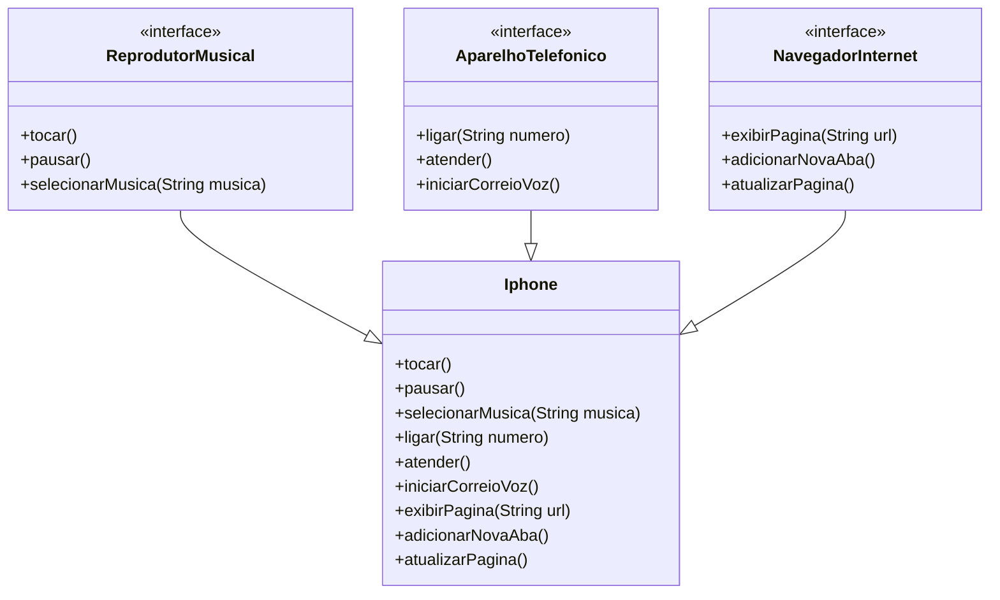

## Desafio UML Iphone 📱 

Conforme a proposta do desafio de testar nossas habilidades em POO foi realizada a UML do Iphone lançando em 2007.

## Modelagem UML

```mermaid
classDiagram
    class ReprodutorMusical {
        <<interface>>
        +tocar()
        +pausar()
        +selecionarMusica(String musica)
    }

    class AparelhoTelefonico {
        <<interface>>
        +ligar(String numero)
        +atender()
        +iniciarCorreioVoz()
    }

    class NavegadorInternet {
        <<interface>>
        +exibirPagina(String url)
        +adicionarNovaAba()
        +atualizarPagina()
    }

    class Iphone {
        +tocar()
        +pausar()
        +selecionarMusica(String musica)
        +ligar(String numero)
        +atender()
        +iniciarCorreioVoz()
        +exibirPagina(String url)
        +adicionarNovaAba()
        +atualizarPagina()
    }

    ReprodutorMusical --|> Iphone 
    AparelhoTelefonico --|> Iphone 
    NavegadorInternet --|> Iphone 
```
